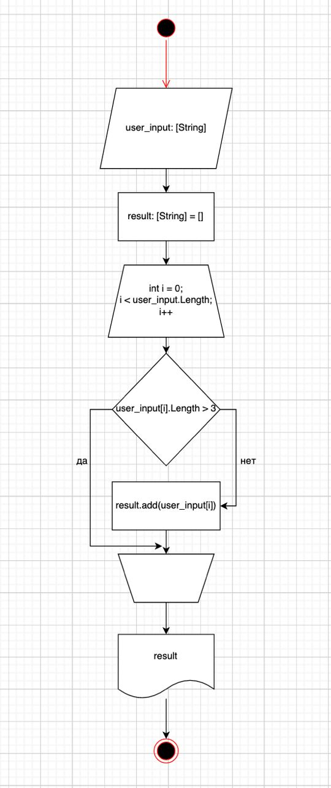

# Final-Test

## Блок-схема

[Блок-схема](resources/block-scheme.drawio)

## Объяснение решения
1. Получаем ввод от пользователя
2. Создаем пустой массив строк, в который добавляем строки подходящие под наше условие
3. Перебираем все строки, введенные пользователем - фильтруем все строки, в которых больше чем 3 символа. Строки с 3 символами и меньше добавляются в наш пустой результирующий массив
4. Вывод результата